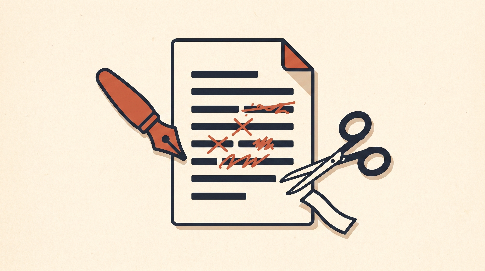

# writing-skills



Skills for writing, editing, and judging content. For Claude Code, Hermes Agent, Codex, and other skill-aware agents.

- **writer** — draft or revise articles, posts, tweets, marketing copy, landing pages. Enforces kill phrases.
- **evaluate-content** — judge a draft before it ships: shareability, readability, voice, cuttability, angle.
- **editor-in-chief** — autonomous diagnose, prescribe, rewrite loop on a finished first draft.
- **hooks** — headlines, titles, subject lines, thread openers, landing page headers.
- **technical-writing** — docs, runbooks, error messages, plans, PR descriptions.
- **document-restructure** — reorganize a document into new sections without changing one sentence.

## Related

- [blader/humanizer](https://github.com/blader/humanizer) — strips AI-isms out of text. Pairs well with `editor-in-chief`.
- [petergyang/no-ai-slop](https://github.com/petergyang/no-ai-slop) — removes 20+ patterns of AI slop from any piece of writing.
- [coreyhaines31/marketingskills](https://github.com/coreyhaines31/marketingskills) — 48 marketing skills including copywriting and copy-editing.

## Install

```bash
git clone https://github.com/exiao/writing-skills.git
cp -R writing-skills/* ~/.claude/skills/    # or ~/.hermes/skills/
```
